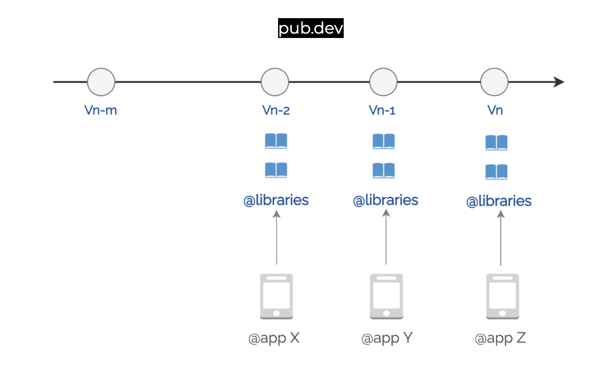
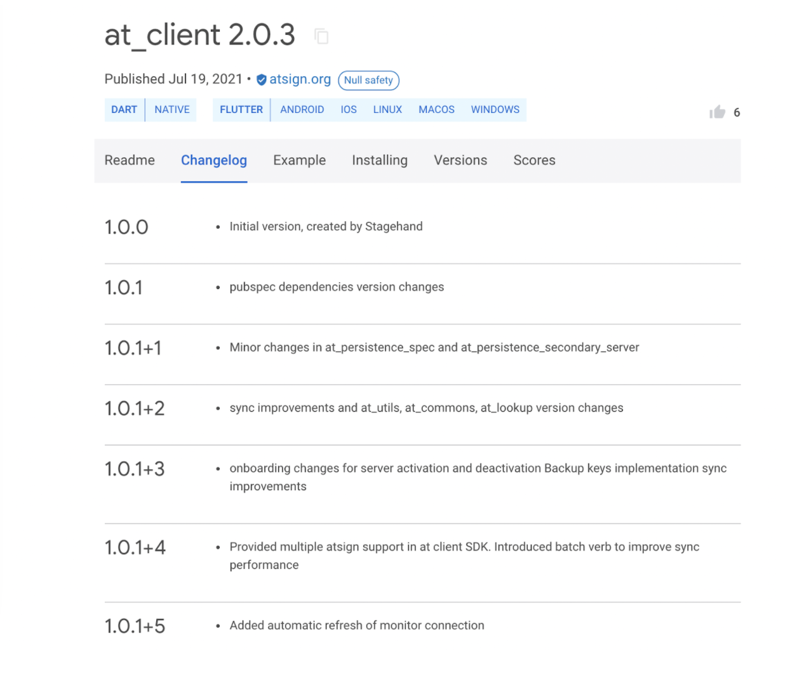
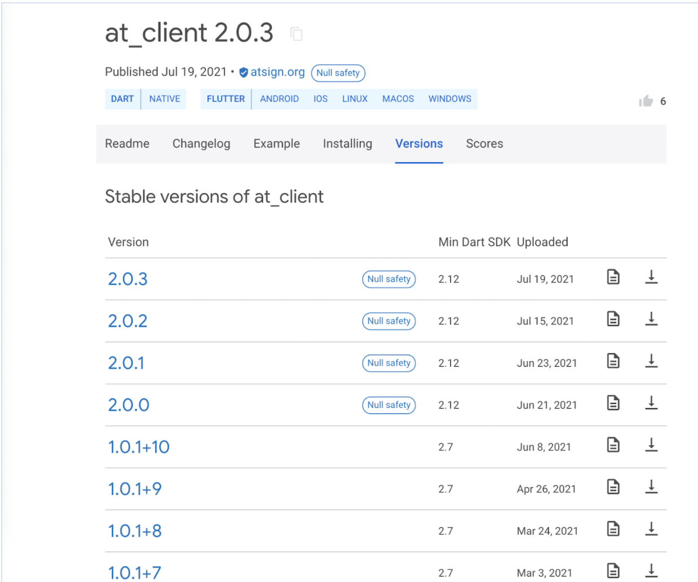
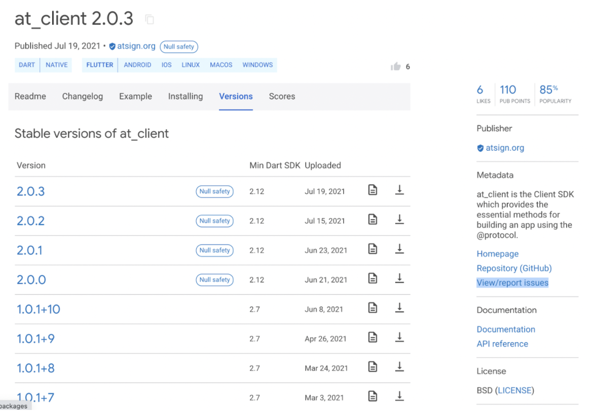
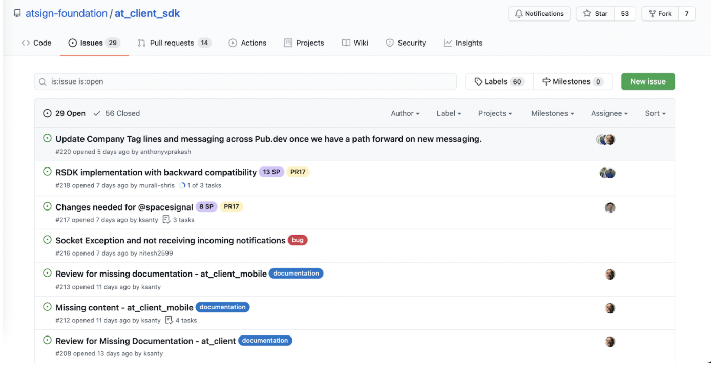
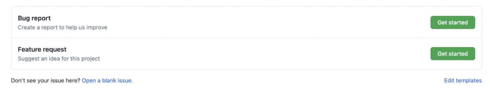
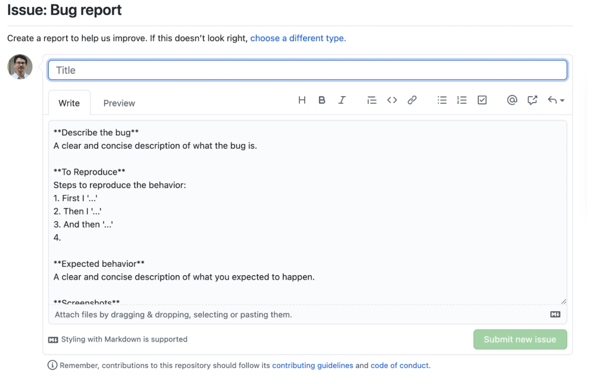

### Now for a little internet optimism

# Contributing guidelines

We 💙 [Pull Requests](https://help.github.com/articles/about-pull-requests/)
for fixing issues or adding features. Thanks for your contribution!

Please read our [code of conduct](code_of_conduct.md), which is based on
[](code_of_conduct.md)


For small changes, especially documentation, you can simply use the "Edit" button
to update the Markdown file, and start the
[pull request](https://help.github.com/articles/about-pull-requests/) process.
Use the preview tab in GitHub to make sure that it is properly
formatted before committing.
A pull request will cause integration tests to run automatically, so please review
the results of the pipeline and correct any mistakes that are reported.

If you plan to contribute often or have a larger change to make, it is best to
setup an environment for contribution, which is what the rest of these guidelines
describe.

## Development Environment Setup


### Prerequisites

   ``` sh
   # show how to install the tools needed to work with the code here
   ```


### GitHub Repository Clone

To prepare your dedicated GitHub repository:

1. Fork in GitHub https://github.com/atsign-foundation/REPO
2. Clone *your forked repository* (e.g., `git clone git@github.com:yourname/REPO`)
3. Set your remotes as follows:

   ```sh
   cd REPO
   git remote add upstream git@github.com:atsign-foundation/REPO.git
   git remote set-url upstream --push DISABLED
   ```

   Running `git remote -v` should give something similar to:

   ```text
   origin  git@github.com:yourname/REPO.git (fetch)
   origin  git@github.com:yourname/REPO.git (push)
   upstream        git@github.com:atsign-foundation/REPO.git (fetch)
   upstream        DISABLED (push)
   ```

   The use of `upstream --push DISABLED` is to prevent those
   with `write` access to the main repository from accidentally pushing changes
   directly.
   
### Development Process

1. Fetch latest changes from main repository:

   ```sh
   git fetch upstream
   ```

1. Reset your fork's `trunk` branch to exactly match upstream `trunk`:

   ```sh
   git checkout trunk
   git reset --hard upstream/trunk
   git push --force
   ```

   **IMPORTANT**: Do this only once, when you start working on new feature as
   the commands above will completely overwrite any local changes in `trunk` content.
1. Edit, edit, edit, and commit your changes to Git:

   ```sh
   # edit, edit, edit
   git add *
   git commit -m 'A useful commit message'
   git push
   ```

1. How to run tests:

   ``` sh
   # explain tests here
   ```

1. Open a new Pull Request to the main repository using your `trunk` branch


## @‎library release process

The @ Foundation produces several widgets and libraries that the app developer
can make use of to develop apps on @‎protocol. These libraries are developed in
Dart & Flutter and published to [pub.dev](https://pub.dev/publishers/atsign.org/packages).



## Following the changes

The @ Foundation publishes libraries and widgets to
[https://pub.dev/publishers/atsign.org/packages](https://pub.dev/publishers/atsign.org/packages).
Each of these libraries contains a tab called “Changelog” that shows various
published versions and a short description of what changes that went in.



Also the “Versions” tab shows the versions published in the reverse
chronological order.



## Reporting a bug

The best place to start reporting bugs on the libraries published by 
@‎protocol would be the “View/report issues” link available on
[pub.dev](https://pub.dev/publishers/atsign.org/packages).



Once the link is clicked, one should be redirected to GitHub repo where the
issue can be reported by clicking on the “New issue” button.



Clicking on the  “New issue” button should take you to the screen to choose
where the issue is a Bug or an Enhancement.



Upon clicking on the “Get started” button against the “Bug Report” you should
be directed to a page with a bug template provided by the @company. Filling
out all of the fields in the template gives the @company a better chance to
reproduce and fix the bug.



## Bug fix and delivery process

* Bugs will initially be placed into the Sprint Planning Board so that they
can be triaged, estimated and scheduled.
* Once work on a bug is scheduled one or more engineers will be assigned to
fixing the bug, and story points will be allocated to match the time estimated
to fix the bug.
* Progress on fixing the bug will be updated in the associated GitHub issue,
and reviewed during subsequent sprint planning meetings where necessary.
* Once a fix is created we will work with the reporter to ensure that the fix
is appropriate to their needs, and where possible this should happen prior to
release to pub.dev

## Closure of the bug

* Where possible the issue associated with the bug should be closed by mutual
consent with the reporter. This could be:
    * The reporter closing the issue because they have found a workaround.
    * The reporter closing the issue because they are satisfied with a fix
    provided.
    * A team member closes the issue after the reporter leaves a comment
    indicating that they are happy for it to be closed.
* If the reporter does not respond within 14 calendar days then we must assume
that they no longer have an interest in fixing the bug and work in progress can
be closed out at the team’s discretion.
