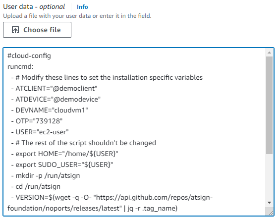

# Automated Installation on Amazon Web Services (AWS)



When launching an instance on EC2 choose settings as usual for the instance type etc.

A security group with no external ports open can be created or reused.

Expand the `Advanced details` section at the bottom of the Launch an Instance page:

<div align="left">

<figure><figcaption></figcaption></figure>

</div>

Scroll down to the `User data - optional` box and paste in your customised YAML e.g.:

```yaml
#cloud-config
runcmd:
  - # Modify these lines to set the installation specific variables
  - ATCLIENT="@democlient"
  - ATDEVICE="@demodevice"
  - DEVNAME="cloudvm1"
  - OTP="739128"
  - USER="ec2-user"
  - # The rest of the script shouldn't be changed
  - export HOME="/home/${USER}"
  - export SUDO_USER="${USER}"
  - mkdir -p /run/atsign
  - cd /run/atsign
  - VERSION=$(wget -q -O- "https://api.github.com/repos/atsign-foundation/noports/releases/latest" | jq -r .tag_name)
  - wget https://github.com/atsign-foundation/noports/releases/download/${VERSION}/universal.sh
  - sh universal.sh -t device -c ${ATCLIENT} -d ${ATDEVICE} -n ${DEVNAME}
  - /usr/local/bin/at_activate enroll -a ${ATDEVICE} -s ${OTP} -p noports -k /home/${USER}/.atsign/keys/${ATDEVICE}_key.atKeys -d ${DEVNAME} -n "sshnp:rw,sshrvd:rw"
  - chown -R ${USER}:${USER} /home/${USER}/.atsign
```

Which will end up looking something like this:

<div align="left">

<figure><figcaption></figcaption></figure>

</div>

The VM config should now be ready for `Launch instance`

After a few minutes the APKAM key can be approved:

```
at_activate approve -a @demodevice --arx noports --drx cloudvm1
```

If the VM isn't quite ready you'll see:

```
Found 0 matching enrollment records
No matching enrollment(s) found
```

Waiting a little longer and retrying should produce a successful approval:

```
Found 1 matching enrollment records
Approving enrollmentId 0bd3613d-d3e2-45b3-b175-8cab06c9bad0
Server response: AtEnrollmentResponse{enrollmentId: 0bd3613d-d3e2-45b3-b175-8cab06c9bad0, enrollStatus: EnrollmentStatus.approved}
```

The VM is now ready for connection with the NoPorts client.
