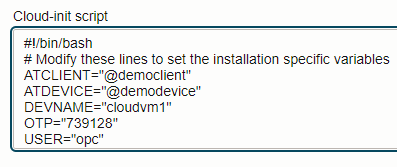

# Automated Installation on Oracle Cloud Infrastructure (OCI)

When starting a VM on OCI first click the `Show advanced options` button having selected the usual options above that.

<div align="left">

<figure><figcaption></figcaption></figure>

</div>

Then (in the `Management` tab) select `Paste cloud-init script`

<div align="left">

<figure><figcaption></figcaption></figure>

</div>

And paste your customised script into the `Cloud-init script` box:

```bash
#!/bin/bash
# Modify these lines to set the installation specific variables
ATCLIENT="@democlient"
ATDEVICE="@demodevice"
DEVNAME="cloudvm1"
OTP="739128"
USER="opc"
# The rest of the script shouldn't be changed
export HOME="/home/${USER}"
export SUDO_USER="${USER}"
mkdir -p /run/atsign
cd /run/atsign
VERSION=$(wget -q -O- "https://api.github.com/repos/atsign-foundation/noports/releases/latest" | grep -Po '"tag_name": "v\K.*?(?=")')
wget https://github.com/atsign-foundation/noports/releases/download/v${VERSION}/universal.sh
sh universal.sh -t device -c ${ATCLIENT} -d ${ATDEVICE} -n ${DEVNAME}
/usr/local/bin/at_activate enroll -a ${ATDEVICE} -s ${OTP} -p noports -k /home/${USER}/.atsign/keys/${ATDEVICE}_key.atKeys -d ${DEVNAME} -n "sshnp:rw,sshrvd:rw"
chown -R ${USER}:${USER} /home/${USER}/.atsign
```

<div align="left">

<figure><figcaption></figcaption></figure>

</div>

The VM is now ready for `Create`

After a few minutes the APKAM key can be approved:

```bash
at_activate approve -a @demodevice --arx noports --drx cloudvm1
```

If the VM isn't quite ready you'll see:

```bash
Found 0 matching enrollment records
No matching enrollment(s) found
```

Waiting a little longer and retrying should produce a successful approval:

```bash
Found 1 matching enrollment records
Approving enrollmentId 0bd3613d-d3e2-45b3-b175-8cab06c9bad0
Server response: AtEnrollmentResponse{enrollmentId: 0bd3613d-d3e2-45b3-b175-8cab06c9bad0, enrollStatus: EnrollmentStatus.approved}
```

The VM is now ready for connection with the NoPorts client.
