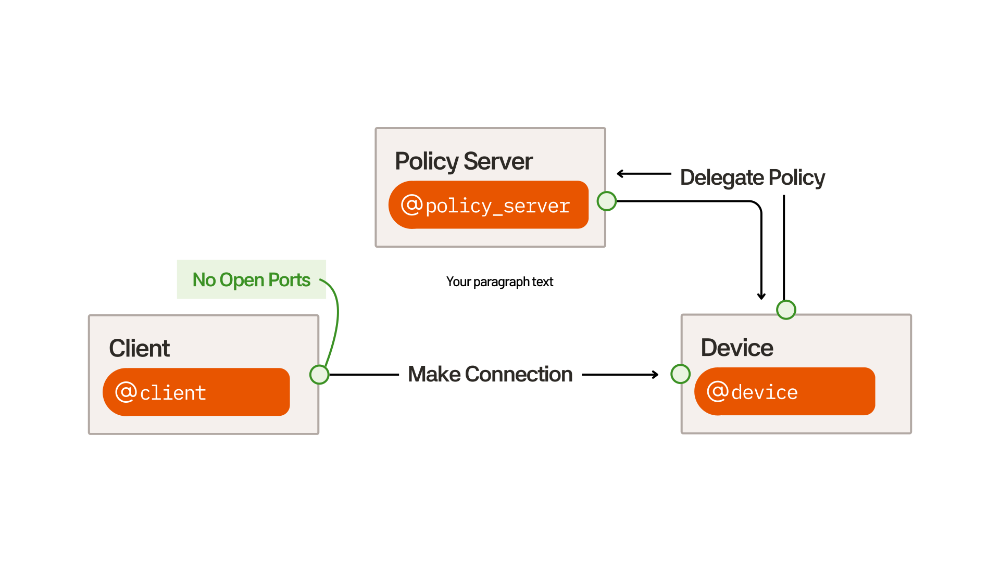

# Policy Service Installation

### Architecture

All devices have no open ports to the public Internet. The policy server delegates access into device. Modifying the policy rules gives you finegrain control on which clients get access to which devices and on what host and port.

<figure><picture><source srcset="../.gitbook/assets/3.svg" media="(prefers-color-scheme: dark)"></picture><figcaption><p>Client / Device / Policy Server architecture</p></figcaption></figure>

### Terminology

| Machine Type   | Description                                                                                                                                                                       |
| -------------- | --------------------------------------------------------------------------------------------------------------------------------------------------------------------------------- |
| Client machine | <p>The machine establishing connections.</p><p></p><p>All manager key copies are kept on this machine in ~/.atsign/keys, where subsequent copies are made for other machines.</p> |
| Device machine | <p>The remote machine that you are connecting to.</p><p></p><p>This has an actively running NoPorts daemon that will service connection requests from clients.</p>                |
| Policy machine | <p>A machine running the policy service that responds to policy requests made by NoPorts daemons.<br><br>This has an actively running NoPorts Policy Service.</p>                 |

### Prerequisites

Before you begin the installation, please ensure the following steps are complete:

1. **You own at least 3 Atsigns:** one as the client, one as the device, and one for policy. You may purchase more Atsigns through our [professional tier](https://my.noports.com/no-ports-plans).
2. **Installation & Activation**: NoPorts is installed and Atsigns are activated on at least two machines, one to connect _from_ and one to connect _to_. [View installation guides](./).

### Step 1: Activate Policy Atsign on Client machine

If your policy Atsign is already activated, then you may skip this step. This step can only be completed once.

<details>

<summary>Steps to be completed on the Client machine</summary>

In this step, we will be activating the policy Atsign on your **client machine**. The initial activation happens in this step and administering a copy securely will be done in the next step. Atsign activation can only be done once. If your Atsign is already activated, you can move onto the next step.

1. Run the onboard command.

On your client machine, ensure you have the `at_activate` binary installed.

Replace `@my_policy_atsign` with your Atsign.

```bash
at_activate onboard -a @my_policy_atsign
```

2. You will get an OTP from your email, enter that into the program. If it expires, simply rerun the first step.
3. Your new key file should be in `~/.atsign/keys/` You can validate via `ls -la ~/.atsign/keys/`&#x20;

</details>

### Step 2: Set up binaries on Policy machine

<details>

<summary>Steps to be completed on the Policy machine</summary>

Navigate to the NoPorts GitHub Releases page and copy the link address for the **file matching your operating system**.&#x20;

Latest release: [https://github.com/atsign-foundation/noports/releases/latest](https://github.com/atsign-foundation/noports/releases/latest)

Open a terminal, and from your home directory run the following command to download the file and save it as `sshnpd.tgz`.&#x20;

```bash
curl -L -o sshnp.tgz <YOUR URL>
```

Example (for x86\_64 machine):&#x20;

```bash
curl -L -o sshnp.tgz https://github.com/atsign-foundation/noports/releases/download/v5.15.0/sshnp-linux-x64.tgz
```

Example (for ARM machine):

```bash
curl -L -o sshnp.tgz https://github.com/atsign-foundation/noports/releases/download/v5.15.0/sshnp-linux-arm64.tgz
```

Once this is done, extract the contents of the file to your home directory.

```bash
tar -xvzf sshnp.tgz
cd sshnp
```

After extraction, copy the `npp_atserver` and `at_activate` binary to `/usr/bin`

```bash
sudo cp ./npp_atserver ./at_activate /usr/bin
```

</details>

### Step 3: Administer key copy to Policy machine

This step requires shell access on both your **client machine** and **policy machine**.

Once your policy key file exists (e.g. `~/.atsign/keys/@policy_atsign_key.atKeys` ) on your client machine, it is time to give a copy of it to the policy machine. This is known as an "APKAM copy" with restricted namespace permissions and can be revoked later on.

<details>

<summary>Steps to be completed on Client machine</summary>

The goal here is for your client machine (which contains the manager set of policy Atsign keys) to administer a copy to the policy machine.

1. Generate an OTP (note this OTP down, as you will need it very soon)

```bash
at_activate otp -a @policy_atsign
```

2. Set up an auto approval service. This will automatically apporove the enrollment request which will be done in the next step.

```bash
at_activate auto -a @policy_atsign -A noports -D policy -L 1 --approve-existing
```

Leave this process running in the background.

</details>

<details>

<summary>Steps to be completed on Policy machine</summary>

1. Enroll

Using the OTP generated from the previous step, send an enrollment request. This enrollment request should be automatically approved (almost immediately) once it is sent, and that is because we set up an auto approval service beforehand.

```bash
at_activate enroll \
  -p noports \
  -n "sshnp:rw,sshrvd:rw"
  -a <@ATSIGN> \
  -s <OTP> \
  -d <DEVICE_NAME> \
  -k ~/.atsign/keys/<@ATSIGN>_key.atKeys \
```

You should see a response like this:

```
Enroll : submitting enrollment requestEnrollment ID: 95a7f54b-a0a2-4c23-9c9c-49654172ed85
Waiting for approval; will check every 10 seconds
    Enroll : submitted OK
      PKAM : Enrollment has been approved (PKAM auth success)Creating atKeys file
[Success] Your .atKeys file saved at /home/user/.atsign/keys/@policy_atsign_key.atKeys
```

If the enrollment request hangs for more than a minute, then ensure you have an auto approval service running on your client machine.

</details>

### Step 4: Set up NoPorts Policy Service

<details>

<summary>Step to be completed on the Policy machine</summary>

1. Set up the systemd file.

Copy and paste this content to `/etc/systemd/system/npp_atserver.service`&#x20;

Modify these fields accordingly:

* `User=noports`  - change this to the Linux username
* `POLICY_ATSIGN=@policy_atsign` - change this to your Policy Atsign

```
[Unit]
Description=NoPorts Policy Service
After=network-online.target
Wants=network-online.target
StartLimitIntervalSec=60
StartLimitBurst=3

[Service]
Type=simple
User=noports

# MANDATORY: Policy manager address (atSign)
Environment=POLICY_ATSIGN=@policy
# Comment out to disable verbose logging
Environment=v="-v"

ExecStart=/usr/bin/npp_atserver \
    -a ${POLICY_ATSIGN} \
    "$v"

StandardOutput=journal
StandardError=journal
SyslogIdentifier=npp_atserver-policy

Restart=on-failure
RestartSec=3s
TimeoutStopSec=30s

[Install]
WantedBy=multi-user.target
```

2. Start your new systemd service

```bash
sudo systemctl daemon-reload
sudo systemctl enable npp_atserver.service
sudo systemctl start npp_atserver.service
```

3. Tail the logs and ensure the output looks healthy

```bash
journalctl -u npp_atserver.service -f
```

What healthy output looks like:

```
SHOUT|2025-04-16 19:12:51.399918|PolicyServiceWithAtClient|Loading groups via AtClient 
SHOUT|2025-04-16 19:12:52.293882|PolicyServiceWithAtClient|Load complete 
SHOUT|2025-04-16 19:12:52.294012| npp |Daemon atSigns: {} 
```

</details>

### Step 5: Register your daemon with the policy service

<details>

<summary>Step to be completed on your Device machine</summary>

Depending on what version your NoPorts daemon you are running, you will be editing a different configuration file:

```bash
sshnpd --version
```

| sshnpd version < v5.14.13                            | sshnpd version >= v5.14.13 |
| ---------------------------------------------------- | -------------------------- |
| `/etc/systemd/system/sshnpd.service.d/override.conf` | `/etc/noports/sshnpd.yaml` |

1. If your sshnpd version is less than v5.14.13, edit the `/etc/systemd/system/sshnpd.service.d/override.conf`  file.

Edit the "delegate\_policy" environment variable to your Policy Atsign.&#x20;

```yaml
Environment=delegate_policy="@policy_atsign"
```

2. If your sshnpd version is greater or equal than v5.14.13, edit the `/etc/noports/sshnpd.yaml`  file.

Edit the "policy:" to your Atsign **without its "@" at symbol**. Example:

```
  policy: policy_atsign
```

3. Then run the following command to restart the daemon.

```bash
sudo systemctl daemon-reload && sudo systemctl restart sshnpd
```

Finishing this step will register your NoPorts daemon to send policy requests to the delegated policy Atsign when a non-manager attempts to make a request to your device machine.

</details>

### Step 6: Writing your policy rules

<details>

<summary>Steps to be completed on the Client machine</summary>

Now it's time to write policy rules.

1. Download the latest sshnp binaries from our [releases](https://github.com/atsign-foundation/noports/releases/latest).

```bash
curl -L -o /tmp/sshnp.tgz https://github.com/atsign-foundation/noports/releases/download/v5.15.0/sshnp-linux-x64.tgz
cd /tmp
tar -xvzf sshnp.tgz
cd sshnp
sudo cp np_admin /usr/bin
```

2. Download web assets

This next step requires **git** and **npm** installed on your machine.&#x20;

```bash
cd /tmp
git clone https://github.com/atsign-foundation/noports
cd noports/apps/admin/webapp
npm i && npm run build
sudo mkdir -p /usr/bin/web/admin
sudo cp -r dist/* /usr/bin/web/admin/
```

If the `npm run build` step fails, ensure you have an up-to-date version of `npm`&#x20;

3. Write Policy rules

Run the following command:

```
np_admin
```

This will start a web server. Open the web server at `https://localhost:3000`&#x20;

Now you can&#x20;

* Create user groups
* Monitor policy logs

Below is an example of a test group that gives @some\_atsign access to  @bob's device "device1" on localhost:22 and localhost:3389.

<figure><figcaption></figcaption></figure>

</details>
