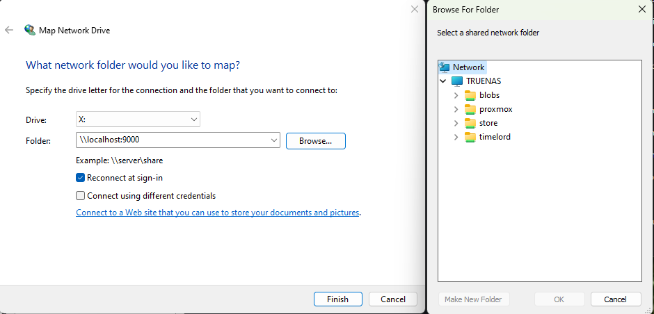

# 🗄️ SMB

## Overview

In this guide, we demonstrate how to use the NoPorts Tunnel to mount a SMB share on a remote development machine on 192.168.1.90 to localhost:9000 so we can access the SMB share service locally.

The command should look like:

```bash
npt -f @alice_client -t @alice_device -d my_server -r @rv_am -p 445 \
-h 192.168.1.90 -l 9000
```


NOTE Make sure the sshnpd daemon is allowing port 445 to the SAMB file server see Basic Usage for details.


Now you can mount the SMB share locally using the file explorer on Windows or the file app on MacOs

<figure><figcaption></figcaption></figure>

Once mounted you can use the file share as normal, as you dismount the file share the NPT command will disconnect.

### To learn more about NPT
