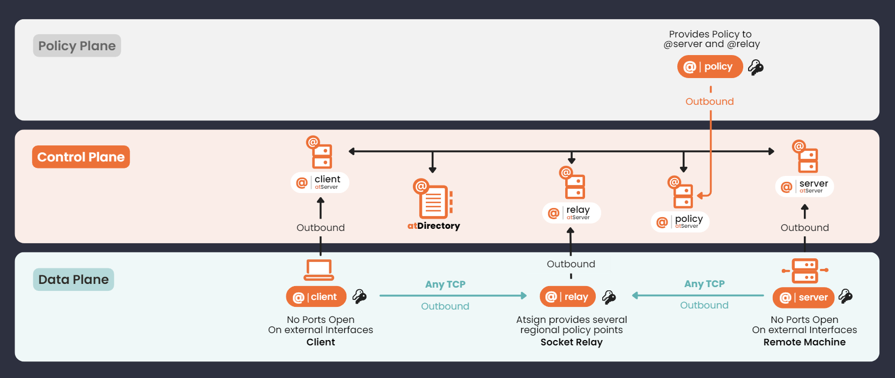

# How It Works

## **Atsign’s Core Technology (a.k.a. Control Plane)**

1. **Addressability**\
   Atsign’s core technology uses identifiers which replace the need to manage IP addresses. If you remember the atSign (Atsign’s version of an address), you can look up the IP address and port in the atDirectory which manages this information for you.
2. **Reachability**\
   **‍**Atsign’s core technology provides each device with its own microservice which makes it reachable from anywhere on the Internet.
3. **No open ports (no network attack surface) on the device**\
   Connections are always made from the device to the microservice, meaning that no ports ever need to be opened on devices using this technology.
4. **End-to-end encrypted**\
   Information is automatically encrypted on the edge devices before it is sent over Atsign’s control plane.
5. **Zero Trust**\
   Atsign’s technology is designed so that cryptographic keys are only stored on the edge device. No third party or intermediary ever possesses the decryption keys which are required to access the information. You don’t need to trust any of the microservices, because they never see information in the clear.

## **How SSH No Ports uses Atsign’s Control Plane & Policy Plane**

<figure><figcaption>
Planes of the atPlatform
</figcaption></figure>

1. @client makes a request to @relay for two listening TCP/IP ports
2. @client contacts @server to get status and capabilities
3. @server responds if @client is permitted to connect, permission is either given locally or via @policy
4. @client derives a new ephemeral AES 256bit key and sends the key along with the IP/DNS name and one of the ports it received from @relay plus the requested remote host:service
5. @server confirms that @client is allowed to connect and to the service requested either locally or via @policy. If permitted, then @server makes a TCP/IP connection to @relay on the specified port and authenticates
6. @client makes a connection to @relay on the other port and authenticates
7. @relay then relays the data between the two TCP connections **@relay does not have the AES key** so cannot "see" the encrypted dataflow
8. @client listens on the localhost interface of the client and encrypts any connections made to it with the ephemeral AES key from stage 4
9. @server connects the to the required TCP/IP service requested in stage 5 and then encrypts the connection and forwards on to @relay
10. At this point a client application connects to the localhost interface on the client on the requested port and any data is encrypted and passed via @relay and on to @server then on to the listening service.

If the service requested by @client was SSH on @server for example. The `ssh` command would be directed to locahost on @client and yet in fact that connection would be forward to the `sshd` daemeon on @server, via the outbound connections to @relay.

This handshake takes a few seconds to make but once established the connection is near real time. You can see the handshake happening as you use the `sshnp` or the `npt` commands and if you what to see more details then, add the `-v` flag.

