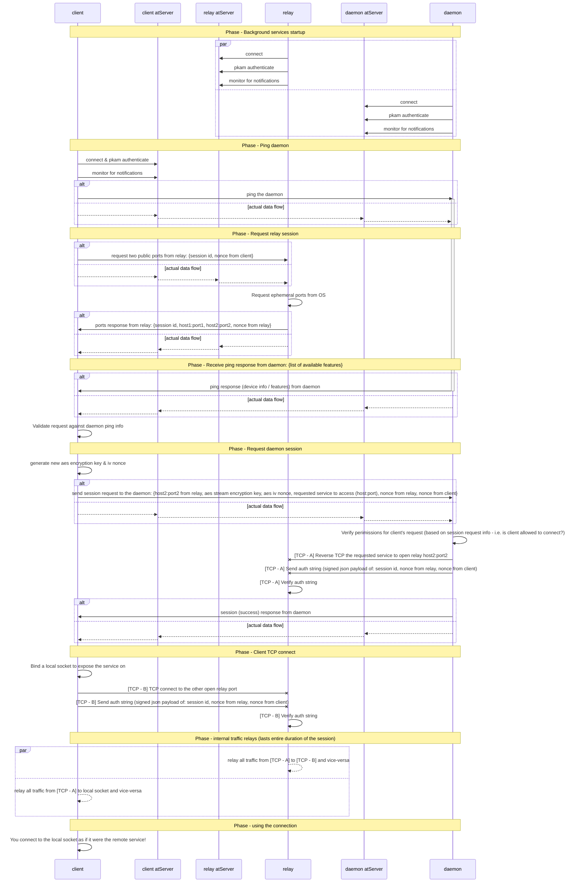

# Sequence Diagram

The following sequence diagram covers the "Happy path" for the startup of a NoPorts session. When a step fails with an error, then the client halts the process, all existing connections automatically timeout and shutdown after a short period of time.


To view this diagram in more detail, click `Export as PDF` in the top right corner of the page, then zoom in using the built-in browser zoom functionality.


