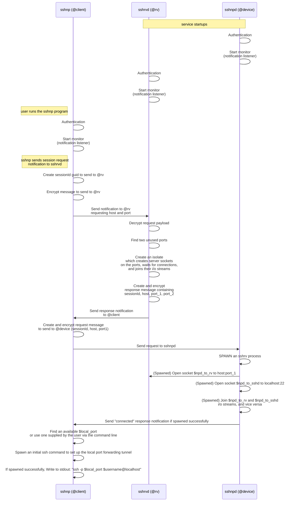
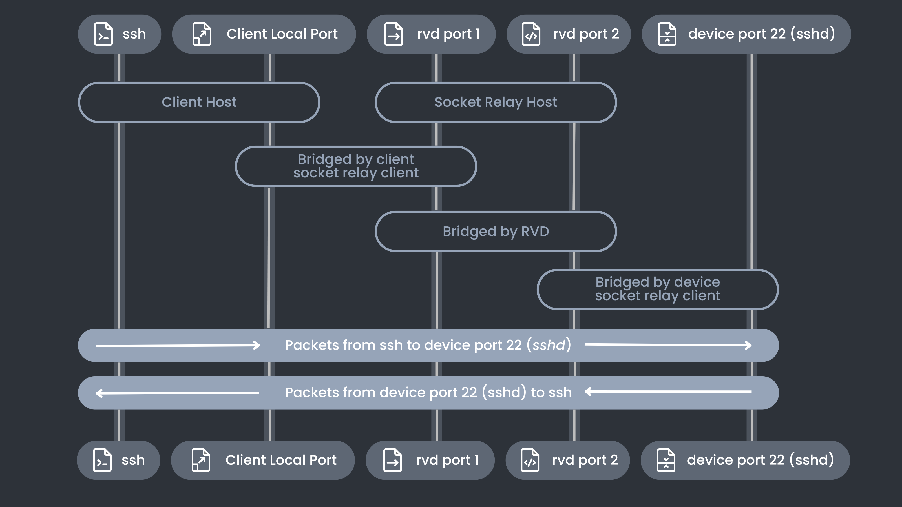

# Under The Hood


This document describes version 4.0.0-rc.2. Other versions use a different method of forming the connection.


## Overview

There are three atSigns involved - one for each of

* the noports daemon program (`sshnpd`) which runs on the device you want to ssh to
* the noports client program (`sshnp`) which you run on the device you want to ssh from
* the noports tcp rendezvous program (`sshrvd`)

The programs communicate via the atProtocol and the atClient SDKs; as a result, the payloads of the messages the programs send to each other are all end-to-end encrypted.

In brief

* The client (`sshnp`) creates a unique guid for the session
  * and sends a request notification to the `sshrvd` for a port1/port2 pair for this sessionId
* The sshrvd
  * finds a pair of available ports
  * opens server sockets for both of them
    * **Note**: rvd will allow just a single client socket to connect to each server socket
      * and will bridge them together
  * sends response to the client
* The client
  * receives the response notification from sshrvd (rv\_host, rv\_port\_1, rv\_port\_2)
  * and sends a request notification to the `sshnpd` including the sessionId and the rv\_host:rv\_port\_1
* The daemon (`sshnpd`)
  * opens a socket to the rv\_host:rv\_port\_1
  * and opens a socket to its local sshd port
  * and bridges the sockets together
  * and sends a response notification to the `sshnp` client
* The client
  *   issues an ssh command like this to set up the ssh tunnel and do a local port forwarding

      ```
      /usr/bin/ssh gary@85.239.63.180 -p 40189 -i /Users/gary/.ssh/noports \
        -L 58358:localhost:22 -t -t -f \
        -o StrictHostKeyChecking=accept-new -o IdentitiesOnly=yes \
        -o BatchMode=yes -o ExitOnForwardFailure=yes \
        sleep 15
      ```
* The client displays a message to the user that they may now `ssh -p $local_port $username@localhost`, i.e. `ssh -p 58358 gary@localhost` in the example above, and exits

This high-level flow is visualized in the diagrams below.

**NB** Requests from unauthorized client atSigns are ignored. Note that one may also completely prevent requests from any other atSigns ever even reaching the daemon by using the atProtocol's `config:allow` list feature.

> In the personal edition of noports, a daemon may have only a single authorized client atSign.
>
> The Team and Enterprise editions will allow for multiple authorized client atSigns, controlled not by the daemon but by a separate noports authorization controller process, with its own atSign.

### Overview diagram


### Control plane

In the following sequence diagram, atServer address lookup flows, authentication flows, key exchange flows, precise encryption mechanics and notification transmission flows are not covered in detail; those details are provided in the links provided in the "Further Details" section below.

Since the full details are provided in those other links, the `client_1 -> atServer_1 -> atServer_2 -> client_2` message flows are abbreviated to `@atSign_1 -> @atSign_2` in the sequence diagram. Thus, for example, `sshnp (@client)` encapsulates both the sshnp program and the sshnp atServer



### Data plane

Once the interactions above have completed

* the sshnpd nor the sshnp programs are no longer involved
* there is a new sshrv process running on the device host which pipes i/o between device port 22 and $rv\_host:$rv\_port\_1
* there is an ssh process running on the client host which provides the local port forwarding tunnel
* User may now type "ssh -p $local\_port username@localhost" with traffic flowing
  * client ssh program <===>
    * $client\_localhost:$local\_port <===> bridged by client-side ssh tunnel to
      * $rv\_host:$rv\_port\_2 <===> bridged by sshrvd to
        * $rv\_host:$rv\_port\_1 <===> bridged by device-side sshrv to
          * $device\_host:22 <===>
            * device sshd program



## Further Details

In the sections above, we referred to "authentication", "sending notifications" and "receiving notifications", and we made the statement that "the payloads of the messages the programs send to each other are all end-to-end encrypted"

Here are some links to detailed diagrams covering

* [how atClients authenticate to their atServers](https://github.com/atsign-foundation/at\_protocol/blob/trunk/decisions/2023-01-pkam-per-app-and-device.md#appendix---current-flows)
* [how encrypted data is exchanged](https://github.com/atsign-foundation/at\_protocol/blob/trunk/usage-examples/how-to-exchange-encrypted-data.md) (including how keys are exchanged)
* [how notifications work](https://github.com/atsign-foundation/at\_protocol/blob/trunk/usage-examples/how-notifications-work.md)
