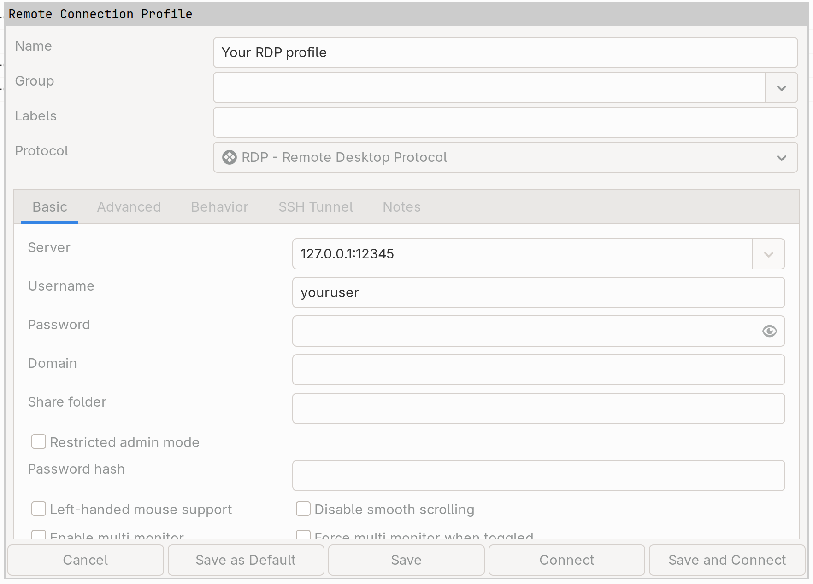

# MCP

### Video Tutorial&#x20;



### Prerequisites

Before continuing, make sure that the following steps have been completed on the machine you’ll be using to remotely connect to your MCP server:

* NoPorts Desktop is installed.
* Your NoPorts Atsigns are activated, and the associated keys are saved locally.
* You are signed in with your device Atsign and have recorded your authentication passcode by opening the Authenticator tab and noting the displayed OTP.

If these steps are not yet complete, please follow **Steps 1 through 5.3** in the [Quick Start guide for macOS or Windows](../installation/quick-start-for-macos-and-windows/) then return to this page.

### Step 1: Set up the MCP Server&#x20;


Steps 1 through 4 are to be completed on the machine that your MCP server will be running on


In this example, the MCP server is implemented in **Python** using the **FastMCP** library. The reference code can be found at: [https://gofastmcp.com/deployment/http](https://gofastmcp.com/deployment/http)

In this example, the server will be running locally at:

* **Host**: `127.0.0.1`
* **Port**: `3000`

You can choose whichever port number works best for you.


The MCP Server must be served over a TCP Protocol to function with NoPorts.


### Step 2: Set up the NoPorts Daemon&#x20;

Select the operating system running on the machine your MCP server is running on and follow the steps to install the NoPorts Daemon.



Download the installer from GitHub by running the following command:

```bash
curl -L https://github.com/atsign-foundation/noports/releases/latest/download/universal.sh -o universal.sh
```

To check if the installation downloaded correctly:

```bash
stat universal.sh
```

Make the script executable and run the script by running the command below:

```bash
chmod u+x universal.sh
./universal.sh
```

During installation, you’ll be prompted to enter the following items:

You may be asked to enter your password if your machine requires sudo privileges.

**The install type**

* Enter `device` when prompted.

**Your Atsigns**

* Client Atsign: e.g., `@example01_np`
* Device Atsign: e.g., `@example02_np`

**Your device name**

* This should be the name of the machine you're currently installing on.



Download the installer from GitHub by running the following command:

```bash
curl -L https://github.com/atsign-foundation/noports/releases/latest/download/universal.sh -o universal.sh
```

To check if the installation downloaded correctly:

```bash
stat universal.sh
```

Make the script executable and run the script by running the command below:

```bash
chmod u+x universal.sh
./universal.sh
```

During installation, you’ll be prompted to enter the following items:

You may be asked to enter your password if your machine requires sudo privileges.

**The install type**

* Enter `device` when prompted.

**Your atSigns**

* Client atSign: e.g., `@example01_np`
* Device atSign: e.g., `@example02_np`

**Your device name**

* This should be the name of the machine you're currently installing on.



Download the msi installer [from GitHub](https://github.com/atsign-foundation/noports/releases/latest/download/sshnp-windows-x64.zip). You can run the msi right from the windows-bundle.zip.

Ensure both Core Tools & Daemon Service are being installed.

<figure><figcaption></figcaption></figure>



### Step 3: Configure Permit‑Open on Localhost:3000

1\. Edit the override configuration file:

```bash
sudo vim /etc/systemd/system/sshnpd.service.d/override.conf
```

2\. Under **“any additional command line arguments for sshnpd”**, add the following line:

```bash
Environment=additional_args="--permit-open=\"localhost:3000,127.0.0.1:3000\""
```

3\. Apply the changes by restarting and reloading the service:

```bash
sudo systemctl restart sshnpd.service
sudo systemctl daemon-reload
```

### Step 4: Initiate an authorization request

Select the operating system running on the machine your MCP server is running on and follow the steps provided.



Run the following command to make an authorization request:&#x20;


Be sure to replace the following values:

`@<REPLACE>_np` with your **device Atsign**,

&#x20;`<PASSCODE>` with the **passcode generated in step 5 of the prerequisite instructions**&#x20;

`@<REPLACE>_np_key` with your **device Atsign**,&#x20;

`<DEVICE_NAME>` with the name of the machine you are on


<pre class="language-bash"><code class="lang-bash">~/.local/bin/at_activate enroll -a @&#x3C;REPLACE>_np \
<strong>  -s &#x3C;PASSCODE> \
</strong><strong>  -p noports \
</strong><strong>  -k ~/.atsign/keys/@&#x3C;REPLACE>_np_key.atKeys \
</strong><strong>  -d &#x3C;DEVICE_NAME> \
</strong><strong>  -n "sshnp:rw,sshrvd:rw"
</strong></code></pre>

Once you see this text, you're ready to continue to the next step.

```
Submitting enrollment request 
Enrollment ID: ---------------------
Waiting for approval; will check every 10 seconds
```



Run the following command to make an authorization request:&#x20;


Be sure to replace the following values:

`@<REPLACE>_np` with your **device atSign**,

&#x20;`<PASSCODE>` with the **passcode generated in step 5 of the prerequisite instructions**&#x20;

`@<REPLACE>_np_key` with your **device atSign**,&#x20;

`<DEVICE_NAME>` with the name of the machine you are on


<pre class="language-bash"><code class="lang-bash">~/.local/bin/at_activate enroll -a @&#x3C;REPLACE>_np \
<strong>  -s &#x3C;PASSCODE> \
</strong><strong>  -p noports \
</strong><strong>  -k ~/.atsign/keys/@&#x3C;REPLACE>_np_key.atKeys \
</strong><strong>  -d &#x3C;DEVICE_NAME> \
</strong><strong>  -n "sshnp:rw,sshrvd:rw"
</strong></code></pre>

Once you see this text, you're ready to continue to the next step.

```
Submitting enrollment request 
Enrollment ID: ---------------------
Waiting for approval; will check every 10 seconds
```



Run the following command to make an authorization request.&#x20;


Be sure to replace the following values:

`@<REPLACE>_np` with your **device atSign**,

&#x20;`<PASSCODE>` with the **passcode generated in Step 4**,&#x20;

`<USER>` with your **Windows username**,&#x20;

`@<REPLACE>_np_key` with your **device atSign**,&#x20;

`<DEVICE_NAME>` with the name of the machine you are on


<pre class="language-bash"><code class="lang-bash">at_activate.exe enroll -a "@&#x3C;REPLACE>_np" `
<strong>  -s &#x3C;PASSCODE> `
</strong><strong>  -p noports `
</strong><strong>  -k C:\Users\&#x3C;USER>\.atsign\keys\@&#x3C;REPLACE>_np_key.atKeys `
</strong><strong>  -d &#x3C;DEVICE_NAME> `
</strong><strong>  -n "sshnp:rw,sshrvd:rw"
</strong></code></pre>

Once you see this text, you're ready to continue to the next step.

```
Submitting enrollment request 
Enrollment ID: ---------------------
Waiting for approval; will check every 10 seconds
```


If you encounter a handshake exception, it usually means your root certificates are outdated. To refresh them, run the following command with administrator privileges:<kbd>Install-Script -Name UpdateRootCertificates</kbd>




### Step 5: Approve the request


Steps 5 through 7 are to be coompleted on the machine you'll be using to remotely connnect to your MCP server.


1\. Click on Requests and approve the pending request. The request will then move to the approved enrollments list.

2\. After a few seconds, the request will also show as approved on the machine you are connecting to.

### Step 6: Create the profile in the desktop app

Click on Connection and create a profile for your MCP connection. You will enter the following information

1. Profile Name - The name that will be displayed in the profile list.
2. Device Atsign - Your device Atsign (eg mcp\_demo\_02\_np).
3. Device Name - The name of your remote device.
4. Relay - Select the relay server closest to you for optimum speed.
5. Local Port - The port you will use on your local machine.
6. Local Host - The hostname or IP address to bind to on your local machine.
7. Remote Host - The hostname or IP address of the machine you are connecting to.
8. Remote Port - The port that will be used on the remote machine.


In this example, the we use details shown in the video. When following along, be sure to replace these with **your own data**.


|                   |                    |
| ----------------- | ------------------ |
| **Profile Name**  | mcp\_demo          |
| **Device Atsign** | @mcp\_demo\_02\_np |
| **Device Name**   | mcp\_demo          |
| **Relay**         | @rv\_am            |
| **Local Port**    | 3000               |
| **Local Host**    |                    |
| **Remote Host**   | 127.0.0.1          |
| **Remote Port**   | 3000               |

### Step 7: Interact with the MCP Server via Witsy

**Whitsy** is an open‑source LLM client. Download and install it from [https://witsyai.com](https://witsyai.com/).

1\. Open Whitsy, select **MCP**, then click the **+** icon to add a new MCP server.

2\. Set **Type** to _streamable HTTP_, choose any **Label** you like, and enter the following URL:

```bash
http://127.0.0.1:3000/mcp
```

Click **Save** and you should see a green checkmark.

3\. Go to **Chat**, then open **Customize** and enable the **process\_data** option.

4\. To test, type the following:

```bash
process data using MCP "hello"
```

