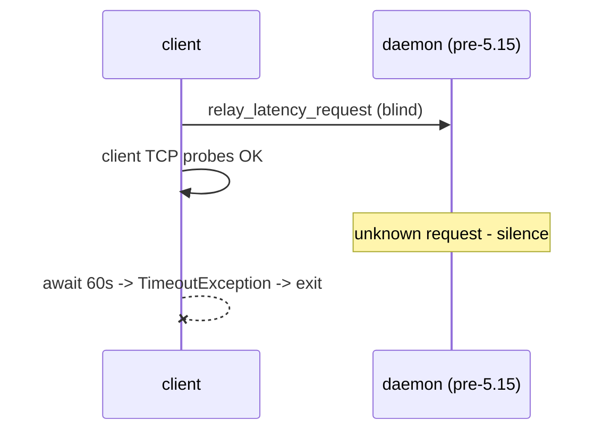
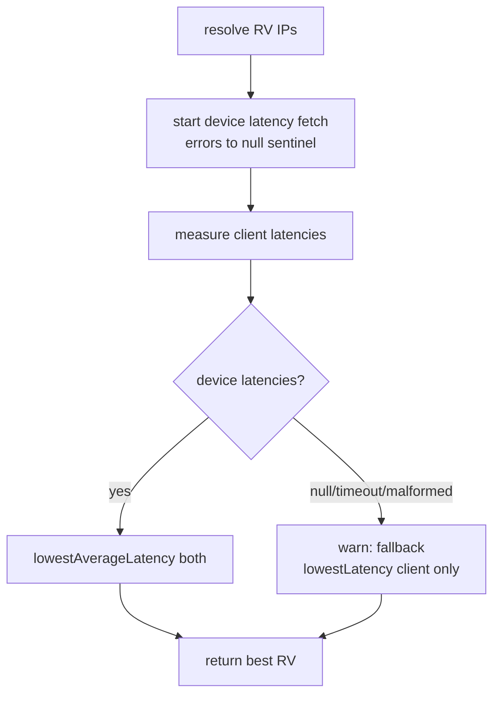

# Automatic relay (RV) selection: client-only fallback

Issue: [atsign-foundation/noports#2752](https://github.com/atsign-foundation/noports/issues/2752)

## Problem

`sshnp` / `npt` without `-r` selects a relay by combining client→RV and
device→RV latency measurements (`RelaySelector.selectBestRelay`). The
device side depends on the daemon responding to a `relay_latency_request`
notification. Daemons older than v5.15.0 (handler added in `ef7c6aca9`)
don't implement this request — they log `unknown request` and drop it,
so the client never receives a `relay_latency_response`.

Two failure modes resulted:

1. The client blocked for up to 60s (`fetchDeviceLatencies`'s internal
   timeout) before dying with an uncaught `TimeoutException`.
2. That internal timeout is only armed *after* the initial `notify(...)`
   call returns. `AtClientBindings.notify` retries internally with no
   overall deadline, so a stalled send left the timeout never armed and
   the process hung indefinitely — with no exception and no log to
   explain why.

## Fix

`selectBestRelay` now treats a missing/timed-out/malformed device latency
report as degraded input, not a fatal error, and falls back to selecting
the relay with the lowest *client-only* latency.

Key changes in `lib/src/common/relay_selector.dart`:

- `selectBestRelay(...)` gained `Duration deviceLatencyTimeout = const
  Duration(seconds: 20)` (down from the previous unbounded/60s wait).
- The device-latency future is wrapped with an outer `.timeout(...)`
  applied to the whole `fetchDeviceLatencies(...)` call, not just the
  internal completer. This bounds a stalled `notify` retry loop as well
  as a stalled response — the root cause of the unbounded hang.
- Errors from that future (timeout, malformed JSON, any other exception)
  are caught via `.onError` **at the point the future is created**, before
  the client latency probe is awaited, collapsing to a `null` sentinel.
  Attaching the handler at creation time (rather than at the later
  `await`) avoids Dart raising an unhandled async error if the future
  rejects while the client probe is still in flight.
- A new `lowestLatency(Map<String, int>)` helper selects the best RV from
  a single latency map (client-only), mirroring `lowestAverageLatency`'s
  semantics (skip `-1`, throw `StateError` if nothing is reachable).
- Logs before the wait ("waiting up to Ns for device latency report...")
  and a warning on fallback, so the perceived hang is visible in `-v`
  output even in the (now bounded) 20s case.

No changes were made to `create_sshnp.dart`, `npt.dart`, or
`sshnpd_impl.dart` — the daemon side was already correct, and relay
selection runs before feature negotiation is available in the client
startup flow, so a `DaemonFeature` gate wasn't a viable alternative for
this fix (tracked as a possible follow-up).

## Compatibility

| Fleet | Remotely fixable? | Remediation |
|-------|-------------------|--------------|
| Pre-5.15 daemons | No (customer devices) | None needed — client fallback handles them forever |
| Already-shipped 5.15.0 clients | No (hang is in the binary) | Upgrade client to 5.15.1+, or upgrade the paired daemon to >=5.15.0 (daemon then responds, no timeout) |

## Risks

- The fallback picks the client-optimal RV, which may be device-suboptimal.
  This is acceptable: strictly better than hanging, and identical to what
  `-r <one rv>` users get today.
- 20s is still a noticeable pause against old daemons. A future
  `DaemonFeature` gate could eliminate it once relay selection has access
  to feature negotiation.
