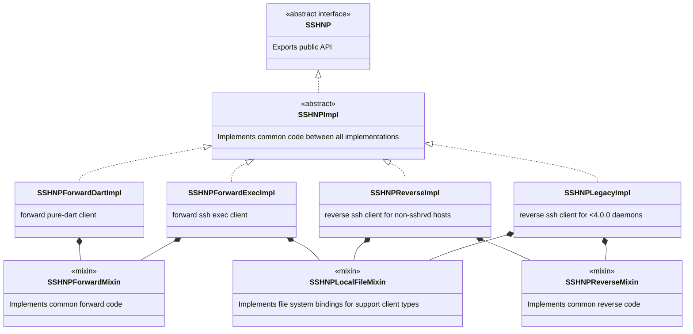
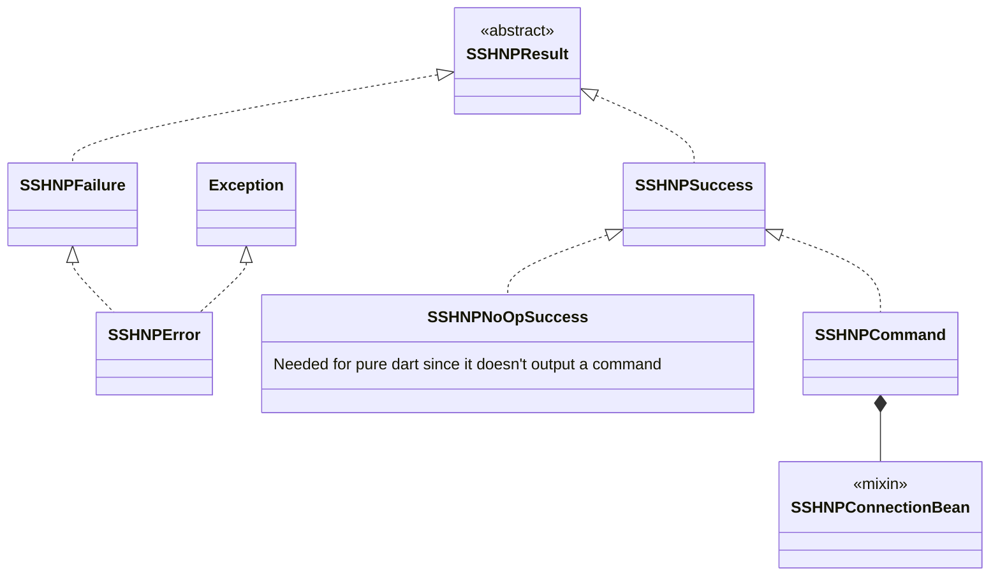

# SSHNP Class Diagrams

## SSHNPImpl Family

```mermaid
classDiagram
    class SSHNP{
        <<abstract interface>>
      Exports public API
    }
    class SSHNPImpl{
        <<abstract>>
      Implements common code between all implementations
    }

    class SSHNPForwardDartImpl {
        forward pure-dart client
    }
    class SSHNPForwardExecImpl {
        forward ssh exec client
    }
    class SSHNPReverseImpl {
        reverse ssh client for non-sshrvd hosts
    }
    class SSHNPLegacyImpl {
        reverse ssh client for <4.0.0 daemons
    }

    class SSHNPForwardMixin{
      <<mixin>>
      Implements common forward code
    }
    class SSHNPReverseMixin{
      <<mixin>>
      Implements common reverse code
    }
    class SSHNPLocalFileMixin{
      <<mixin>>
      Implements file system bindings for support client types
    }
    SSHNP <|.. SSHNPImpl

    SSHNPImpl <|.. SSHNPForwardDartImpl
    SSHNPImpl <|.. SSHNPForwardExecImpl
    SSHNPImpl <|.. SSHNPReverseImpl
    SSHNPImpl <|.. SSHNPLegacyImpl

    SSHNPForwardDartImpl *-- SSHNPForwardMixin
    SSHNPForwardExecImpl *-- SSHNPForwardMixin

    SSHNPForwardExecImpl *-- SSHNPLocalFileMixin
    SSHNPReverseImpl *-- SSHNPLocalFileMixin
    SSHNPLegacyImpl *-- SSHNPLocalFileMixin

    SSHNPReverseImpl *-- SSHNPReverseMixin
    SSHNPLegacyImpl *-- SSHNPReverseMixin
```

## SSHNPResult Family

```mermaid
classDiagram
    SSHNPResult <|.. SSHNPSuccess
    SSHNPResult <|.. SSHNPFailure

    SSHNPFailure <|.. SSHNPError
    Exception <|.. SSHNPError

    SSHNPSuccess <|.. SSHNPNoOpSuccess
    SSHNPSuccess <|.. SSHNPCommand

    SSHNPCommand *-- SSHNPConnectionBean
    class SSHNPResult {
      <<abstract>>
    }
    class SSHNPConnectionBean {
        <<mixin>>
    }
    class SSHNPNoOpSuccess {
      Needed for pure dart since it doesn't output a command
    }
```