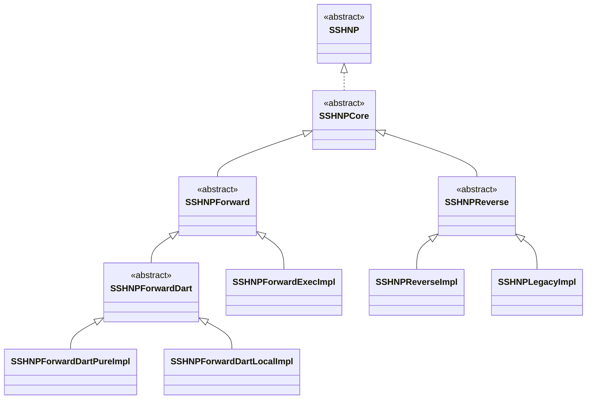
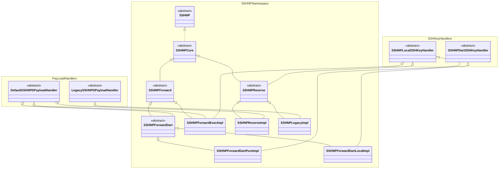
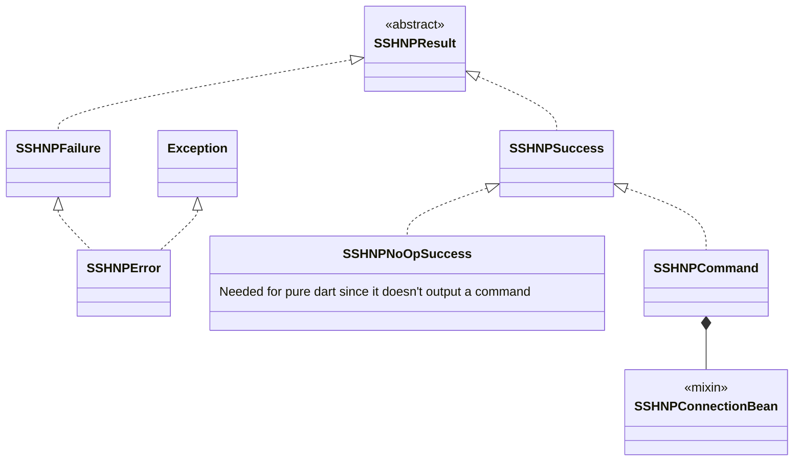
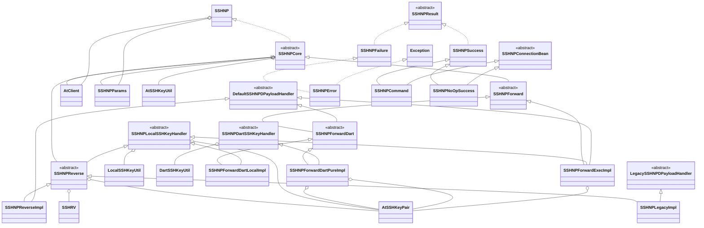

# SSHNP Class Diagrams

Table of contents:
- [SSHNP Class Diagrams](#sshnp-class-diagrams)
  - [SSHNP Family (basic)](#sshnp-family-basic)
  - [SSHNP Family (with mixins)](#sshnp-family-with-mixins)
  - [SSHNPResult Family](#sshnpresult-family)
  - [Near Full Diagram (Generated and Stripped)](#near-full-diagram-generated-and-stripped)
  - [Full Diagram (Generated)](#full-diagram-generated)

## SSHNP Family (basic)

## SSHNP Family (with mixins)

## SSHNPResult Family

## Near Full Diagram (Generated and Stripped)

## Full Diagram (Generated)

```mermaid
classDiagram
  class SSHNPReverseImpl
  SSHNPReverseImpl : +init() dynamic
  SSHNPReverseImpl : +run() dynamic
  SSHNPReverse <|-- SSHNPReverseImpl
  DefaultSSHNPDPayloadHandler <|-- SSHNPReverseImpl

  class SSHNPReverse
  <<abstract>> SSHNPReverse
  SSHNPReverse : +sshrvGenerator SSHRV
  SSHNPReverse o-- SSHRV
  SSHNPReverse : +ephemeralKeyPair AtSSHKeyPair
  SSHNPReverse o-- AtSSHKeyPair
  SSHNPReverse : +localUsername String
  SSHNPReverse : +usingSshrv bool
  SSHNPReverse : +init() dynamic
  SSHNPReverse : +cleanUp() dynamic
  SSHNPCore <|-- SSHNPReverse
  SSHNPLocalSSHKeyHandler <|-- SSHNPReverse

  class SSHNPLegacyImpl
  SSHNPLegacyImpl : +init() dynamic
  SSHNPLegacyImpl : +run() dynamic
  SSHNPReverse <|-- SSHNPLegacyImpl
  LegacySSHNPDPayloadHandler <|-- SSHNPLegacyImpl

  class DefaultSSHNPDPayloadHandler
  <<abstract>> DefaultSSHNPDPayloadHandler
  DefaultSSHNPDPayloadHandler : #ephemeralPrivateKey String
  DefaultSSHNPDPayloadHandler : +useLocalFileStorage bool
  DefaultSSHNPDPayloadHandler : +handleSshnpdPayload() FutureOr<bool>

  class LegacySSHNPDPayloadHandler
  <<abstract>> LegacySSHNPDPayloadHandler
  LegacySSHNPDPayloadHandler : +handleSshnpdPayload() bool

  class SSHNPLocalSSHKeyHandler
  <<abstract>> SSHNPLocalSSHKeyHandler
  SSHNPLocalSSHKeyHandler : -_sshKeyUtil LocalSSHKeyUtil
  SSHNPLocalSSHKeyHandler o-- LocalSSHKeyUtil
  SSHNPLocalSSHKeyHandler : -_identityKeyPair AtSSHKeyPair?
  SSHNPLocalSSHKeyHandler o-- AtSSHKeyPair
  SSHNPLocalSSHKeyHandler : +keyUtil LocalSSHKeyUtil
  SSHNPLocalSSHKeyHandler o-- LocalSSHKeyUtil
  SSHNPLocalSSHKeyHandler : +identityKeyPair AtSSHKeyPair?
  SSHNPLocalSSHKeyHandler o-- AtSSHKeyPair
  SSHNPLocalSSHKeyHandler : +init() dynamic

  class SSHNPDartSSHKeyHandler
  <<abstract>> SSHNPDartSSHKeyHandler
  SSHNPDartSSHKeyHandler : -_sshKeyUtil DartSSHKeyUtil
  SSHNPDartSSHKeyHandler o-- DartSSHKeyUtil
  SSHNPDartSSHKeyHandler : +keyUtil DartSSHKeyUtil
  SSHNPDartSSHKeyHandler o-- DartSSHKeyUtil

  class SSHNPCore
  <<abstract>> SSHNPCore
  SSHNPCore : +logger AtSignLogger
  SSHNPCore o-- AtSignLogger
  SSHNPCore : +atClient AtClient
  SSHNPCore o-- AtClient
  SSHNPCore : +params SSHNPParams
  SSHNPCore o-- SSHNPParams
  SSHNPCore : +sessionId String
  SSHNPCore : +remoteUsername String
  SSHNPCore : +host String
  SSHNPCore : +port int
  SSHNPCore : +localPort int
  SSHNPCore : +sshrvdPort int?
  SSHNPCore : #doneCompleter Completer~void~
  SSHNPCore o-- Completer~void~
  SSHNPCore : -_initializeStarted bool
  SSHNPCore : #initializedCompleter Completer~void~
  SSHNPCore o-- Completer~void~
  SSHNPCore : #sshnpdAck bool
  SSHNPCore : #sshnpdAckErrors bool
  SSHNPCore : +sshrvdAck bool
  SSHNPCore : +identityKeyPair FutureOr~AtSSHKeyPair?~
  SSHNPCore : +done dynamic
  SSHNPCore : +initializeStarted bool
  SSHNPCore : +initialized dynamic
  SSHNPCore : +clientAtSign String
  SSHNPCore : +sshnpdAtSign String
  SSHNPCore : +namespace String
  SSHNPCore : +keyUtil AtSSHKeyUtil
  SSHNPCore o-- AtSSHKeyUtil
  SSHNPCore : +getNamespace()$ String
  SSHNPCore : +init() dynamic
  SSHNPCore : #completeInitialization() void
  SSHNPCore : +handleSshnpdResponses() dynamic
  SSHNPCore : #handleSshnpdPayload()* FutureOr<bool>
  SSHNPCore : #startAndWaitForInit() dynamic
  SSHNPCore : #notify() dynamic
  SSHNPCore : #fetchRemoteUserName() dynamic
  SSHNPCore : #getHostAndPortFromSshrvd() dynamic
  SSHNPCore : #sharePublicKeyWithSshnpdIfRequired() dynamic
  SSHNPCore : #waitForDaemonResponse() dynamic
  SSHNPCore : #cleanUp() FutureOr<void>
  SSHNPCore : -_getAtKeysRemote() dynamic
  SSHNPCore : +Future() dynamic
  SSHNPCore : +() dynamic
  SSHNPCore : +>() dynamic
  SSHNPCore : +listDevices() dynamic
  SSHNP <|.. SSHNPCore

  class SSHNPArg
  SSHNPArg : +format ArgFormat
  SSHNPArg o-- ArgFormat
  SSHNPArg : +name String
  SSHNPArg : +abbr String?
  SSHNPArg : +help String?
  SSHNPArg : +mandatory bool
  SSHNPArg : +defaultsTo dynamic
  SSHNPArg : +type ArgType
  SSHNPArg o-- ArgType
  SSHNPArg : +allowed Iterable~String~?
  SSHNPArg : +parseWhen ParseWhen
  SSHNPArg o-- ParseWhen
  SSHNPArg : +aliases List~String~?
  SSHNPArg : +negatable bool
  SSHNPArg : +hide bool
  SSHNPArg : +args$ List~SSHNPArg~
  SSHNPArg : +profileNameArg$ SSHNPArg
  SSHNPArg o-- SSHNPArg
  SSHNPArg : +helpArg$ SSHNPArg
  SSHNPArg o-- SSHNPArg
  SSHNPArg : +keyFileArg$ SSHNPArg
  SSHNPArg o-- SSHNPArg
  SSHNPArg : +fromArg$ SSHNPArg
  SSHNPArg o-- SSHNPArg
  SSHNPArg : +toArg$ SSHNPArg
  SSHNPArg o-- SSHNPArg
  SSHNPArg : +deviceArg$ SSHNPArg
  SSHNPArg o-- SSHNPArg
  SSHNPArg : +hostArg$ SSHNPArg
  SSHNPArg o-- SSHNPArg
  SSHNPArg : +portArg$ SSHNPArg
  SSHNPArg o-- SSHNPArg
  SSHNPArg : +localPortArg$ SSHNPArg
  SSHNPArg o-- SSHNPArg
  SSHNPArg : +identityFileArg$ SSHNPArg
  SSHNPArg o-- SSHNPArg
  SSHNPArg : +identityPassphraseArg$ SSHNPArg
  SSHNPArg o-- SSHNPArg
  SSHNPArg : +sendSshPublicKeyArg$ SSHNPArg
  SSHNPArg o-- SSHNPArg
  SSHNPArg : +localSshOptionsArg$ SSHNPArg
  SSHNPArg o-- SSHNPArg
  SSHNPArg : +verboseArg$ SSHNPArg
  SSHNPArg o-- SSHNPArg
  SSHNPArg : +remoteUserNameArg$ SSHNPArg
  SSHNPArg o-- SSHNPArg
  SSHNPArg : +rootDomainArg$ SSHNPArg
  SSHNPArg o-- SSHNPArg
  SSHNPArg : +localSshdPortArg$ SSHNPArg
  SSHNPArg o-- SSHNPArg
  SSHNPArg : +legacyDaemonArg$ SSHNPArg
  SSHNPArg o-- SSHNPArg
  SSHNPArg : +remoteSshdPortArg$ SSHNPArg
  SSHNPArg o-- SSHNPArg
  SSHNPArg : +idleTimeoutArg$ SSHNPArg
  SSHNPArg o-- SSHNPArg
  SSHNPArg : +sshClientArg$ SSHNPArg
  SSHNPArg o-- SSHNPArg
  SSHNPArg : +ssHAlgorithmArg$ SSHNPArg
  SSHNPArg o-- SSHNPArg
  SSHNPArg : +addForwardsToTunnelArg$ SSHNPArg
  SSHNPArg o-- SSHNPArg
  SSHNPArg : +configFileArg$ SSHNPArg
  SSHNPArg o-- SSHNPArg
  SSHNPArg : +listDevicesArg$ SSHNPArg
  SSHNPArg o-- SSHNPArg
  SSHNPArg : +bashName String
  SSHNPArg : +aliasList List~String~
  SSHNPArg : +toString() String
  SSHNPArg : +createArgParser()$ ArgParser

  class SSHNPParams
  SSHNPParams : +clientAtSign String
  SSHNPParams : +sshnpdAtSign String
  SSHNPParams : +host String
  SSHNPParams : +device String
  SSHNPParams : +port int
  SSHNPParams : +localPort int
  SSHNPParams : +identityFile String?
  SSHNPParams : +identityPassphrase String?
  SSHNPParams : +sendSshPublicKey bool
  SSHNPParams : +localSshOptions List~String~
  SSHNPParams : +remoteUsername String?
  SSHNPParams : +verbose bool
  SSHNPParams : +rootDomain String
  SSHNPParams : +localSshdPort int
  SSHNPParams : +legacyDaemon bool
  SSHNPParams : +remoteSshdPort int
  SSHNPParams : +idleTimeout int
  SSHNPParams : +addForwardsToTunnel bool
  SSHNPParams : +atKeysFilePath String?
  SSHNPParams : +sshClient SupportedSshClient
  SSHNPParams o-- SupportedSshClient
  SSHNPParams : +sshAlgorithm SupportedSSHAlgorithm
  SSHNPParams o-- SupportedSSHAlgorithm
  SSHNPParams : +profileName String?
  SSHNPParams : +listDevices bool
  SSHNPParams : +toConfigLines() List<String>
  SSHNPParams : +toArgMap() Map<String, dynamic>
  SSHNPParams : +toJson() String

  class SSHNPPartialParams
  SSHNPPartialParams : +profileName String?
  SSHNPPartialParams : +clientAtSign String?
  SSHNPPartialParams : +sshnpdAtSign String?
  SSHNPPartialParams : +host String?
  SSHNPPartialParams : +device String?
  SSHNPPartialParams : +port int?
  SSHNPPartialParams : +localPort int?
  SSHNPPartialParams : +localSshdPort int?
  SSHNPPartialParams : +atKeysFilePath String?
  SSHNPPartialParams : +identityFile String?
  SSHNPPartialParams : +identityPassphrase String?
  SSHNPPartialParams : +sendSshPublicKey bool?
  SSHNPPartialParams : +localSshOptions List~String~?
  SSHNPPartialParams : +remoteUsername String?
  SSHNPPartialParams : +verbose bool?
  SSHNPPartialParams : +rootDomain String?
  SSHNPPartialParams : +legacyDaemon bool?
  SSHNPPartialParams : +remoteSshdPort int?
  SSHNPPartialParams : +idleTimeout int?
  SSHNPPartialParams : +addForwardsToTunnel bool?
  SSHNPPartialParams : +sshClient SupportedSshClient?
  SSHNPPartialParams o-- SupportedSshClient
  SSHNPPartialParams : +sshAlgorithm SupportedSSHAlgorithm?
  SSHNPPartialParams o-- SupportedSSHAlgorithm
  SSHNPPartialParams : +listDevices bool?

  class SSHNPForward
  <<abstract>> SSHNPForward
  SSHNPForward : -_sshrvdPort int
  SSHNPForward : +sshrvdPort int
  SSHNPForward : +requestSocketTunnelFromDaemon() dynamic
  SSHNPCore <|-- SSHNPForward

  class SSHNPForwardDartLocalImpl
  SSHNPForwardDartLocalImpl : +init() dynamic
  SSHNPForwardDartLocalImpl : +run() dynamic
  SSHNPForwardDart <|-- SSHNPForwardDartLocalImpl
  SSHNPLocalSSHKeyHandler <|-- SSHNPForwardDartLocalImpl

  class SSHNPForwardDartPureImpl
  SSHNPForwardDartPureImpl : -_identityKeyPair AtSSHKeyPair
  SSHNPForwardDartPureImpl o-- AtSSHKeyPair
  SSHNPForwardDartPureImpl : +identityKeyPair AtSSHKeyPair
  SSHNPForwardDartPureImpl o-- AtSSHKeyPair
  SSHNPForwardDartPureImpl : +init() dynamic
  SSHNPForwardDartPureImpl : +run() dynamic
  SSHNPForwardDart <|-- SSHNPForwardDartPureImpl
  SSHNPDartSSHKeyHandler <|-- SSHNPForwardDartPureImpl

  class SSHNPForwardExecImpl
  SSHNPForwardExecImpl : +ephemeralKeyPair AtSSHKeyPair
  SSHNPForwardExecImpl o-- AtSSHKeyPair
  SSHNPForwardExecImpl : +init() dynamic
  SSHNPForwardExecImpl : +run() dynamic
  SSHNPForward <|-- SSHNPForwardExecImpl
  SSHNPLocalSSHKeyHandler <|-- SSHNPForwardExecImpl
  DefaultSSHNPDPayloadHandler <|-- SSHNPForwardExecImpl

  class SSHNPForwardDart
  <<abstract>> SSHNPForwardDart
  SSHNPForwardDart : +terminateMessage String
  SSHNPForwardDart : #startInitialTunnel() dynamic
  SSHNPForward <|-- SSHNPForwardDart
  DefaultSSHNPDPayloadHandler <|-- SSHNPForwardDart

  class SSHNPResult
  <<abstract>> SSHNPResult

  class SSHNPSuccess
  SSHNPResult <|.. SSHNPSuccess

  class SSHNPFailure
  SSHNPResult <|.. SSHNPFailure

  class SSHNPError
  SSHNPError : +message Object
  SSHNPError : +error Object?
  SSHNPError : +stackTrace StackTrace?
  SSHNPError : +toString() String
  SSHNPError : +toVerboseString() String
  SSHNPFailure <|.. SSHNPError
  Exception <|.. SSHNPError

  class SSHNPCommand
  SSHNPCommand : +command String
  SSHNPCommand : +localPort int
  SSHNPCommand : +remoteUsername String?
  SSHNPCommand : +host String
  SSHNPCommand : +privateKeyFileName String?
  SSHNPCommand : +sshOptions List~String~
  SSHNPCommand : +args List~String~
  SSHNPCommand : +shouldIncludePrivateKey()$ bool
  SSHNPCommand : +toString() String
  SSHNPSuccess <|-- SSHNPCommand
  SSHNPConnectionBean <|-- SSHNPCommand

  class SSHNPNoOpSuccess
  SSHNPNoOpSuccess : +message String?
  SSHNPNoOpSuccess : +toString() String
  SSHNPSuccess <|-- SSHNPNoOpSuccess
  SSHNPConnectionBean <|-- SSHNPNoOpSuccess

  class SSHNPConnectionBean
  <<abstract>> SSHNPConnectionBean
  SSHNPConnectionBean : -_connectionBean Bean?
  SSHNPConnectionBean : +connectionBean Bean?
  SSHNPConnectionBean : +killConnectionBean() dynamic

  class SSHNP
  SSHNP : +atClient AtClient
  SSHNP o-- AtClient
  SSHNP : +params SSHNPParams
  SSHNP o-- SSHNPParams
  SSHNP : +done dynamic
  SSHNP : +initialized dynamic
  SSHNP : +fromParamsWithFileBindings()$ dynamic
  SSHNP : +init()* dynamic
  SSHNP : +run()* dynamic
  SSHNP : +FutureOr() dynamic
  SSHNP : +() dynamic
  SSHNP : +>() dynamic
  SSHNP : +listDevices()* dynamic

```
